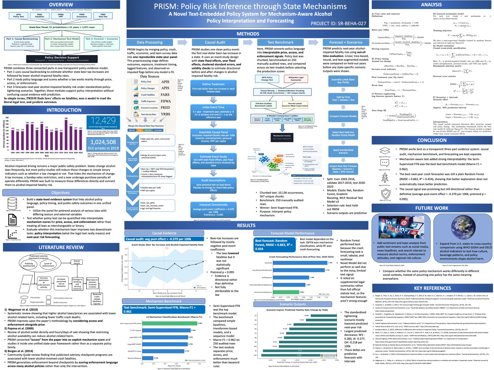

# PRISM Alcohol Policy Impact Atlas

Teacher-facing Senior Project dashboard for **Ishaan Ranjan**.

PRISM is a transparent alcohol-policy evidence system. It combines a 2003-2023 state-year panel with mechanism-aware policy text features, then lets users explore how price, access, and enforcement mechanisms relate to forecasted alcohol-impaired fatality risk.


## What the App Does

- Select a state and inspect observed alcohol-impaired fatality trends.
- Adjust beer-tax, access/Sunday-sales, and underage-purchase enforcement levers.
- Compare baseline and scenario forecasts.
- Explore baseline state-year mechanism positions in a fixed-year 3D price/access/enforcement space.
- Review the SRP weekly research arc, poster preview, model evidence, causal audit, and limitations.
- Jump to the live Senior Project blog: [Ishaan R. - BASIS Senior Projects](https://basisseniorprojects.com/author/ishaan-r-2026/).

## Research Headline Metrics

| Metric | Value | Meaning |
| --- | ---: | --- |
| Mechanism Macro-F1 | 0.962 | Held-out mechanism text benchmark |
| Forecast RMSE | 0.863 | Random Forest held-out crash forecasting error |
| Forecast R-squared | 0.454 | Held-out 2020-2023 forecasting fit |
| Causal post coefficient | -0.379 | Average post-event beer-tax coefficient per 100k |

## Screenshots and Assets

The dashboard includes curated public assets from the PRISM research package:

- `public/assets/social-preview.png`
- `public/assets/pipeline-architecture.png`
- `public/assets/forecast-comparison.png`
- `public/assets/event-study.png`
- `public/assets/scenario-deltas.png`
- `public/assets/azsef-poster-preview.jpg`



## Data Sources

The public app uses curated lightweight artifacts generated from the local PRISM v3/v2 research outputs. Original source families:

- APIS policy data
- FARS alcohol-impaired and alcohol-involved fatality outcomes
- FHWA vehicle miles traveled exposure measures
- FRED economic covariates
- YRBS teen current-use and binge-drinking outcomes

The app does not scrape the blog and does not require paid API keys. The public presentation build keeps the mechanism explorer focused on baseline state-year coordinates instead of free-text law inference.

## Local Development

```bash
npm install
npm run dev
```

Open [http://localhost:3000](http://localhost:3000).

## Verification

```bash
npm run lint
npm run test
npm run build
```

The test suite covers scenario calculations plus the baseline state-year lookup utilities used by the 3D explorer.

## Vercel Deployment

This is a standard Next.js App Router app and can be deployed directly to Vercel.

```bash
npx vercel login
npx vercel
```

Recommended production settings:

- Framework preset: Next.js
- Build command: `npm run build`
- Install command: `npm install`
- Output directory: handled by Next.js
- Environment variables: none required for v1

## Important Limitations

PRISM should be presented as an evidence dashboard, not as causal proof for every hypothetical policy.

- Scenario forecasts are model responses, not guaranteed real-world effects.
- Teen drinking outcomes are secondary because YRBS coverage is sparse.
- Many policy text rows rely on supplemental text; the UI surfaces coverage provenance and text quality.
- The causal audit is directional and centered on a limited set of beer-tax increase events.
- Random Forest performed best for forecasting, but forecasting performance is not the same as causal identification.

## Project Links

- Blog author page: [Ishaan R. - BASIS Senior Projects](https://basisseniorprojects.com/author/ishaan-r-2026/)
- BASIS Peoria 2026 cohort: [Senior Projects Peoria 2026](https://basisseniorprojects.com/peoria-2026/)
